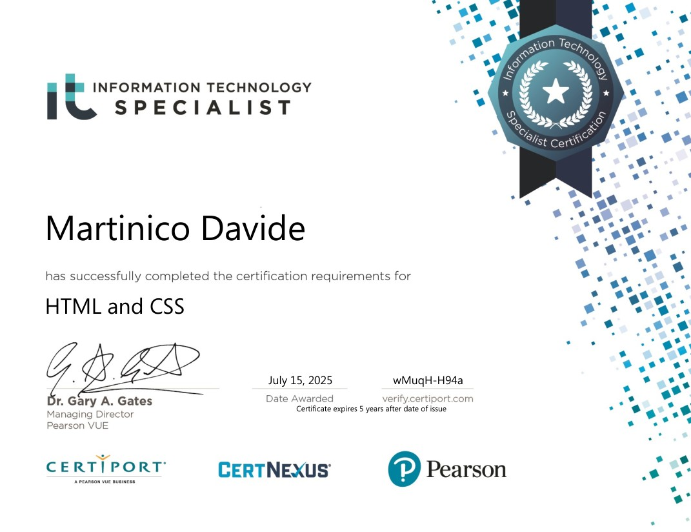
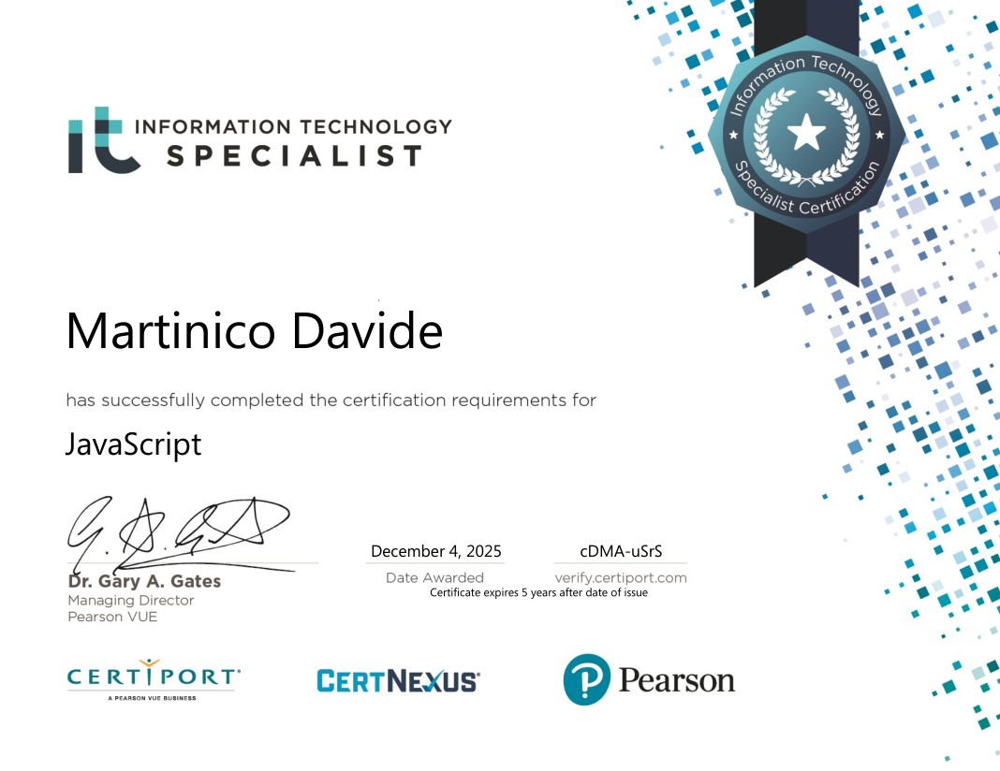
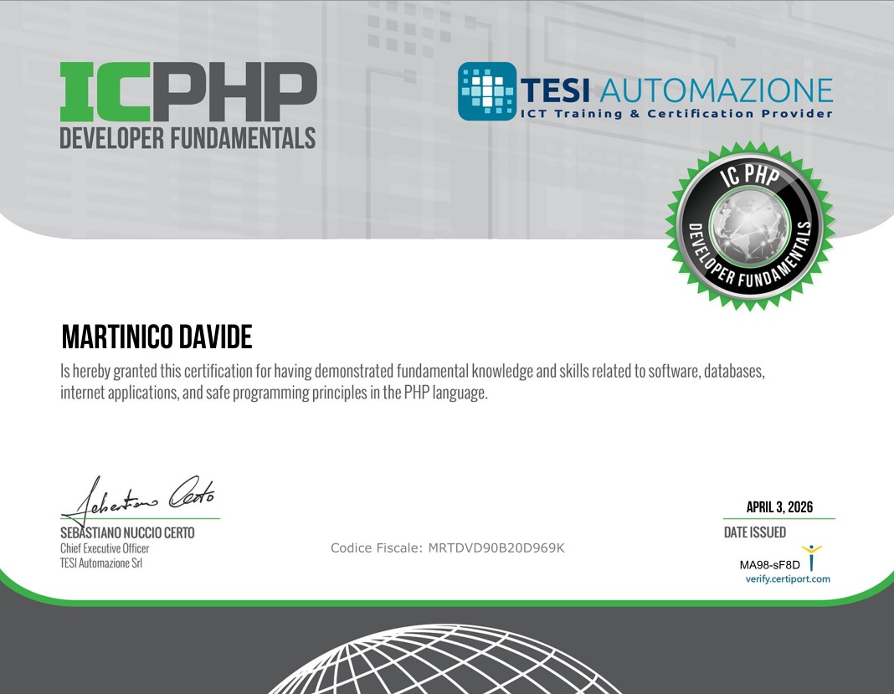

# 👋 Ciao, sono Davide
👨‍💻 Full-Stack Developer (PHP • MySQL • JavaScript • APIs • Cron Jobs • Git)

Sviluppatore full-stack focalizzato su backend PHP e integrazioni API,
con esperienza nella gestione di sistemi multi-tenant e database MySQL.

I miei punti di forza:
• logiche backend solide  
• integrazioni e automazioni (API, cron jobs)  
• attenzione a performance e idempotenza  
• codice leggibile e manutenibile  

Affronto ogni progetto con mentalità analitica e orientata alla crescita,
investendo costantemente tempo nello studio di nuove tecnologie
e nell’evoluzione del mio stack.

---

## 🏅 Certificazioni

<table>
  <tr>
    <td align="center" width="33%">
       
      <b>IT Specialist – HTML & CSS</b> 
      Certiport · Luglio 2025
    </td>
    <td align="center" width="33%">
       
      <b>IT Specialist – JavaScript</b> 
      Certiport · Dicembre 2025
    </td>
    <td align="center" width="33%">
       
      <b>IT Specialist – PHP</b> 
      Certiport
    </td>
  </tr>
</table>

---

## 🛠️ Competenze Tecniche

### 💻 Frontend

---

### ⚙️ Backend

---

## 🧰 Strumenti & Dev Tools

---

## 🚀 Progetti

<table>
  <tr>
    <td width="25%" valign="top" align="left">
### 🧠 Synapsy

App gestione finanze  
• CRUD transazioni  
• KPI mensili  
• PWA in sviluppo  
    </td>
    <td width="25%" valign="top" align="left">
### 🏨 HopySuite

Piattaforma multi-tenant  
• Integrazioni API  
• Automazioni cron  
• Master/worker  
    </td>
    <td width="25%" valign="top" align="left">
### 🐙 OctoMind

GitHub API Explorer  
• Backend Python  
• UI Bootstrap  
• Deploy Render  
    </td>
    <td width="25%" valign="top" align="left">
### 🎬 VistoDa

Storico film e serie TV  
• Backend FastAPI  
• Frontend statico  
• Manifest PWA  
    </td>
  </tr>
</table>

---

## 🔭 Focus Attuale

### 💼 In ambito lavorativo

• Backend PHP su sistemi multi-tenant  
• Integrazioni API e automazioni  
• Ottimizzazione database MySQL  
• Architettura cron / processi backend  
• Adattamento versioni desktop in PWA/mobile  

---

### 📚 In studio e sperimentazione

• Python e FastAPI  
• Progettazione REST API  
• Architetture modulari e scalabili  

---

## 📫 Contatti

🌐 **Portfolio** → <https://davide-martinico-portfolio.netlify.app/>  
✉️ **Email** → [davide017@hotmail.it](mailto:davide017@hotmail.it)

---

## 🌱 Filosofia

Mi appassionano i bonsai.
Una disciplina che unisce arte e tecnica —
proprio come il software.

Entrambi richiedono:
• pazienza  
• cura dei dettagli  
• visione a lungo termine  
• miglioramento continuo
